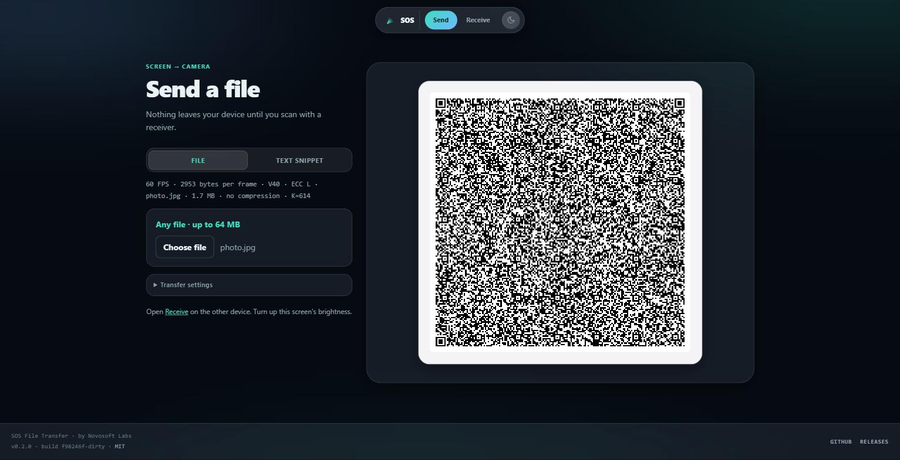

<div align="center">

# SOS File Transfer

**Send Over Screen.** Move a file between two devices using nothing but a
screen and a camera — no network, no app, no account.

By [Novosoft Labs](https://novosoftlabs.com/)

[](LICENSE)
[](package.json)
[](https://github.com/TheCyberBoy/SOS-File-Transfer/actions/workflows/ci.yml)

[Live demo](https://thecyberboy.github.io/SOS-File-Transfer/) · [How it works](#how-it-works) · [Deploying](#deploying) · [License](#license)

</div>

---

Open the sender on one screen, the receiver on another device's camera, and
that's the whole handshake — there isn't one. The sender flashes the file as
an endless stream of animated QR codes; the receiver watches, decodes, and
reassembles it, checksum-verified, entirely offline from that point on. Point
a phone at a laptop, and the file just... arrives.

<p align="center">
  
  <br />
  <sub>The actual sender, live — no network path to the device reading this screen.</sub>
</p>

## What it does

- **Sends files up to 64 MB**, or a pasted block of text — the receiver
  works out which one is arriving on its own.
- **Verifies every transfer** with SHA-256 before the download is ever
  offered.
- **Compresses automatically** when it helps, skips it when it won't
  (a JPEG doesn't need gzip; a log file does).
- **Never drops a transfer to a bad frame.** Built on Luby-transform
  fountain codes — see [How it works](#how-it-works) — so a blurred or
  missed QR frame costs a moment, never the whole stream.
- **Installs like an app.** The hosted build is a PWA that precaches
  itself, including the WASM decoder, so it opens and runs with the network
  off after the first visit.
- **Ships as a single HTML file, too.** `npm run build:standalone`
  produces two self-contained pages with zero external references — email
  one, put it on a USB stick, it just works.
- **Light and dark themes**, a glass-and-gradient interface built around
  calm defaults rather than a technical-tool aesthetic (see
  [Design](#design)).

Nothing here is encrypted. The property this gives you is *no network path*,
not confidentiality — anything on the sending screen is readable by any
camera pointed at it.

## Try it

The hosted build is live at **[thecyberboy.github.io/SOS-File-Transfer](https://thecyberboy.github.io/SOS-File-Transfer/)** — open [`/send/`](https://thecyberboy.github.io/SOS-File-Transfer/send/) on one device and [`/receive/`](https://thecyberboy.github.io/SOS-File-Transfer/receive/) on another, no install needed. To run it locally instead:

```bash
git clone https://github.com/TheCyberBoy/SOS-File-Transfer.git
cd SOS-File-Transfer
npm install
npm run dev
```

Then:

1. **Sender** — open `https://localhost:5173/send/`, choose a file (or
   switch to **Text snippet**), and it starts streaming immediately. Push
   the screen brightness up.
2. **Receiver** — on a second device, open the `Network` address Vite
   prints (`https://<lan-ip>:5173/receive/`), accept the one-time
   certificate warning, tap **Start camera**, and aim it at the first
   screen.
3. **Done** — once recovery completes and the SHA-256 check passes, save
   the file (or copy the text). Nothing was ever written to disk on the
   sender, and nothing on the receiver persists past the tab closing.

<details>
<summary><strong>All the scripts</strong></summary>

| command | what it does |
|---|---|
| `npm run dev` | dev server with hot reload |
| `npm run serve` | build, then serve the production bundle |
| `npm run demo` | locks the sender to two bundled sample images — no file picker, for unattended demo machines |
| `npm test` | golden wire-format vectors and unit tests |
| `npm run build` | hosted site → `dist/` |
| `npm run build:standalone` | both self-contained pages → `dist-standalone/` |
| `npm run build:all` | everything |

</details>

## Project layout

```
send/         sender page + logic — file/text intake, fountain encode, QR render
receive/      receiver page + logic — camera capture, WASM QR decode, fountain assembly
shared/       protocol, codec, and UI code used by both sides
build/        Vite plugins for the hosted/standalone/demo build variants
tests/        golden wire-format vectors + unit tests
.github/      CI, GitHub Pages deploy, and tagged-release workflows
```

The interesting files, if you're reading the source:

- **`shared/protocol.ts`** — the 20-byte frame header and the file-container
  format (name, media type, SHA-256, optional gzip) that rides inside it.
- **`shared/fountain.ts`** — the LT encoder/decoder, including a
  hand-rolled deterministic `Math.log` (see [How it works](#how-it-works)
  for why that exists at all).
- **`send/main.ts`** / **`receive/main.ts`** — everything platform-specific:
  canvas QR rendering on one side, `getUserMedia` + WASM decode workers on
  the other.

## How it works

A screen-to-camera link is one-way — the receiver has no way to ask the
sender to resend a frame it missed to blur, autofocus hunting, or a bad
angle. Looping the same frames on a timer and hoping is the naive fix, and
it's a bad one: miss a frame, and you wait a full loop for it to come back
around.

**The fix is to never send the same thing twice.** Each QR frame carries the
XOR of a *pseudorandom subset* of the file's blocks — a
[Luby transform](https://en.wikipedia.org/wiki/Luby_transform_code) fountain
code. The subset for frame *N* is derived deterministically from *N* itself,
with the subset size drawn from a robust-soliton distribution. The receiver
just needs to collect **any** ~1.15×K distinct frames, in any order, and it
can peel the whole file back out — a dropped frame costs a little time, and
nothing else. Sender and receiver don't even need to agree on a frame rate.

That determinism is also the sharpest edge in this codebase: sender and
receiver must independently compute *bit-identical* pseudorandom sequences,
and `Math.log` is only implementation-*approximated* by spec — V8 and
JavaScriptCore can disagree by a single ULP, which is enough to desync a
degree sample and quietly corrupt a transfer with no error message anywhere.
`fountain.ts` sidesteps this with a deterministic log built from
exactly-specified IEEE-754 operations instead of the platform's own
`Math.log`.

Decoding runs [zxing-cpp](https://github.com/zxing-cpp/zxing-cpp) compiled
to WASM inside a pool of Web Workers, fed by `requestVideoFrameCallback` —
Safari has never shipped the native `BarcodeDetector` API (WebKit bug
281848), so this is the only decoder that's actually portable.

## Deploying

| shape | needs a server? | works offline | how |
|---|---|---|---|
| Hosted site | yes, any static host | after first visit (PWA) | `npm run build` → `dist/` |
| `sos-file-transfer-sender.html` | no | always | `npm run build:standalone` → `dist-standalone/` |
| `sos-file-transfer-receiver.html` | no¹ | always | same |

¹ Opening the standalone receiver from `file://` works on desktop Chrome/Firefox, but **iOS Safari and Android Chrome won't grant a camera to a local file** — serve it over http(s) instead, or use the hosted PWA.

Four GitHub Actions workflows drive this, all in `.github/workflows`:

- **`ci.yml`** — runs on every push/PR: tests, both builds, a check that the
  hosted `receive` bundle stays under 20 KB (catches the standalone build's
  inlined WASM/worker leaking where it shouldn't), and that every page's
  PWA references resolve to real files.
- **`pages.yml`** — deploys to GitHub Pages on every push to `main`. Live at
  [thecyberboy.github.io/SOS-File-Transfer](https://thecyberboy.github.io/SOS-File-Transfer/).
- **`release.yml`** — on a `v*` tag, builds everything and attaches the site
  zip, both standalone HTML files, a debug-signed Android APK, and a
  `SHA256SUMS.txt` to the release. See [Releases](https://github.com/TheCyberBoy/SOS-File-Transfer/releases)
  for the latest build of each.
- **`android.yml`** — on every push/PR touching `android/`: runs the
  `:core` codec's golden-vector tests, then builds a debug APK and uploads
  it as a workflow artifact (Actions tab → the run → Artifacts) — the
  quickest way to get an installable build without setting up the Android
  SDK locally. See [`android/README.md`](android/README.md) for the native
  app's own status.

<details>
<summary><strong>Why the dev server needs https, and other camera gotchas</strong></summary>

Browsers strip `getUserMedia` entirely on insecure origins — a phone
reaching your dev server over plain http gets no camera API at all, full
stop (`localhost` is exempted; a phone on your LAN isn't). That's a
platform rule, not a project choice, which is why `npm run dev` ships with
a self-signed cert (`@vitejs/plugin-basic-ssl`) and the browser warns once
on first visit — tap through it ("Advanced → Proceed" or "Show Details →
visit this website") and the page is still a secure context.

Prop the receiving phone against something rather than hand-holding it —
autofocus hunting from hand tremor is the single biggest throughput killer
in practice.

</details>

## Design

The interface ("Calm Signal") is built around 2026-era patterns rather than
the dashboard-y look this kind of protocol tool usually gets:

| | |
|---|---|
| **Floating pill nav** | not a full-width bar — logo, Send/Receive with an animated active state, theme toggle |
| **Bento home page** | two large action tiles plus four scannable stat tiles under an oversized headline |
| **Split-pane tools** | controls on the left, a sticky live stage (QR stream / camera feed) on the right |
| **Themed dropdowns** | `shared/custom-select.ts` replaces native `<select>` popups, whose OS-drawn chrome can't be reliably recolored via CSS across browsers |
| **Real light + dark themes** | manually toggled and persisted, layered on top of the OS preference |

Glass surfaces are used sparingly and defensively: every panel keeps a
semi-opaque fill and a visible border behind its text rather than leaning on
blur alone for contrast, and `prefers-reduced-transparency` /
`prefers-contrast` / `prefers-reduced-motion` all collapse to flat, static
surfaces.

## Tuning

Both pages have a **Settings** panel — sender: tx fps, bytes/frame, error
correction, display size; receiver: capture width/fps, decode worker count
(applied live, mid-camera). Changing a sender setting restarts the stream;
the receiver resets itself automatically off the new session id.

If a transfer is crawling or not decoding at all, the two things worth
trying on the **sender** first:

```
bytes / frame  →  1465
tx fps         →  24
```

The shipped defaults (2953 bytes/frame, 60 fps) are tuned for the best-case
demo — phone-to-phone, close range — not the safest handshake across an
arbitrary monitor and an arbitrary camera. A denser, multi-code, color-ECC
variant of this same architecture measured ~128 KB/s handheld and ~186 KB/s
propped; this build trades some of that ceiling for staying inside a plain
QR code any camera can read.

## Prior art

- [mohankumarelec/airgapped-qr-code-transfer](https://github.com/mohankumarelec/airgapped-qr-code-transfer) — browser-based QR transfer with compression and sequential chunking.
- [divan/txqr](https://github.com/divan/txqr) — animated QR + fountain codes in Go (2018), with a great write-up on why fountain coding beats looping.
- [sz3/libcimbar](https://github.com/sz3/libcimbar) — skips QR entirely for a custom high-density color code built for this exact channel.

Built on [node-qrcode](https://github.com/soldair/node-qrcode) and
[zxing-wasm](https://github.com/Sec-ant/zxing-wasm).

## License

[MIT](LICENSE) © [Novosoft Labs](https://novosoftlabs.com/)
